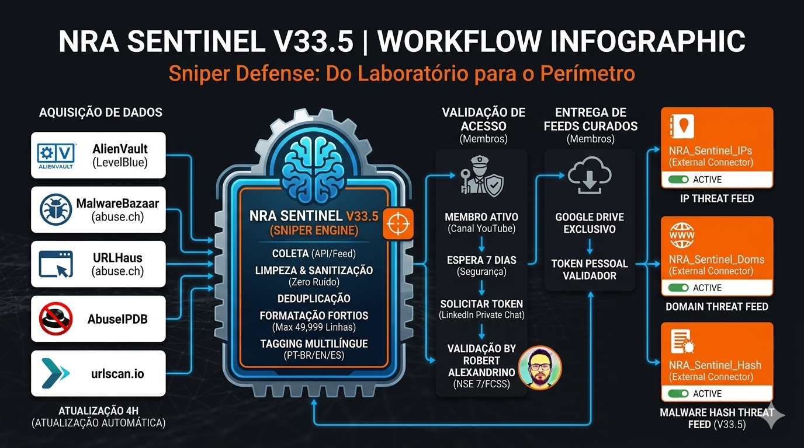
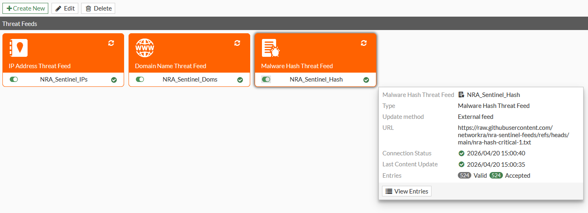

## 🛡️ NRA Sentinel - Inteligência de Ameaças (V33.5)

O **NRA Sentinel** é um projeto desenvolvido com o objetivo de auxiliar profissionais de segurança e redes na proteção de suas infraestruturas contra 0-days, Botnets, Malware e Ransomware. Ele automatiza a coleta e a organização de dados de novas ameaças globais, entregando listas limpas e prontas para uso nos **External Connectors** do FortiGate. Este motor não busca ser uma "solução milagrosa", mas sim uma ferramenta de apoio que soma forças aos recursos que você já utiliza no dia a dia, ideal para quem busca reforçar ainda mais a segurança.

<i>Workflow detalhado: Da coleta em fontes globais à entrega sanitizada no perímetro via FortiOS.</i>

---

<i>Exemplo da integração dos conectores NRA Sentinel operando em ambiente FortiOS.</i>

---

### 🧠 Fontes de Dados

O motor busca informações em fontes respeitadas mundialmente, garantindo que o que chega ao seu firewall tenha passado por um processo de filtragem:

| Player | Função |
| :--- | :--- |
| **AlienVault (LevelBlue)** | Fornece inteligência estratégica sobre campanhas de Ransomware e 0-days. |
| **MalwareBazaar (abuse.ch)** | Entrega assinaturas de arquivos (Hashes) validadas pela comunidade. |
| **URLHaus (abuse.ch)** | Monitora links que estão distribuindo malware no exato momento. |
| **AbuseIPDB** | Ajuda a validar a reputação dos IPs, evitando falsos positivos. |
| **urlscan.io** | Verifica o histórico de segurança dos domínios e URLs processadas. |

---

### 📦 Feeds Disponíveis para Membros

Ao se tornar um apoiador, você terá acesso aos seguintes conectores:

* **IP Threat Feed:** Lista de endereços IPs validados para políticas de bloqueio (Firewall Policy).
* **Domain Threat Feed:** FQDNs e URLs para proteção de DNS, Web Filter ou políticas de bloqueio (Firewall Policy).
* **Malware Hash Feed:** Assinaturas de arquivos para reforço do motor de Antivírus (AV Profile).

---

### ⚙️ Detalhes do Funcionamento

* **Atualização:** Os feeds são processados a cada 4 horas automaticamente.
* **Persistência:** O motor mantém o histórico acumulado (não apaga registros antigos validados).
* **Otimização:** Arquivos organizados com até 49.999 linhas para garantir performance no FortiOS.
* **Limpeza:** Dados sanitizados (sem protocolos ou portas), prontos para leitura nativa do firewall.

---

### 🛡️ Inteligência de Alta Fidelidade & Rolling Buffer (Rotação)

No cenário de ameaças cibernéticas, o volume de hashes de malware cresce exponencialmente. Para manter a filosofia **Sniper** (precisão sobre volume) e garantir que o **NRA Sentinel** não sobrecarregue o hardware do seu FortiGate (especialmente modelos de entrada como 40F, 60F e 80F), implementamos uma lógica de **Rolling Buffer**:

* **Capacidade Inteligente:** O feed de hashes é limitado automaticamente aos **35.000 registros mais recentes**.
* **Performance Garantida:** Mantemos a lista bem abaixo do limite técnico de 50.000 entradas do FortiOS, garantindo que o consumo de memória (**WAD/IPS Engine**) permaneça estável e o sistema opere fora do *Conserve Mode*.
* **Foco no que é Ativo:** Malwares de campanhas obsoletas são "podados" automaticamente, garantindo que sua proteção esteja sempre focada em ameaças ativas e variantes de **0-day**.

> [!IMPORTANT]
> **Complemento, não Substituição:** O NRA Sentinel **não tem o objetivo de substituir a base de dados do FortiGuard**. O FortiGuard é a sua infantaria global e essencial. O Sentinel atua como um **Sniper de elite**: uma camada extra de inteligência cirúrgica, focada em indicadores de alta fidelidade e ameaças emergentes que acabaram de ser detectadas nos laboratórios.

*A eficiência de um feed de Threat Intel não é medida por quantos itens ele contém, mas pela relevância do que ele bloqueia hoje.*

---

### 🤝 Valorização e Colaboração

Gostaria de compartilhar com vocês o racional por trás deste projeto:

Eu adoraria poder distribuir essa infraestrutura de forma totalmente aberta para toda a comunidade. Porém, o desenvolvimento do NRA Sentinel exige muitas horas de estudo, pesquisa e tempo para manter o projeto ativo.

A decisão de manter o acesso exclusivo para os membros do canal **não visa o enriquecimento próprio**, mas sim:

1. **Ser justo com quem apoia meu trabalho:** Basicamente é uma forma de retribuir aos amigos que acreditam e contribuem com o canal NetworkRA.
2. **Sustentabilidade do Projeto:** O apoio dos inscritos/membros é sempre muito importante e me mantém motivado a continuar evoluindo o projeto em busca de melhorias contínuas.
3. **Valorização Profissional:** Acredito que o compartilhamento técnico deve andar junto com a valorização do tempo e do esforço de cada um. Valorizar o tempo dedicado à engenharia de dados é o que transforma uma simples lista em uma solução real de proteção 0-day. O tempo é o nosso bem mais precioso; nunca o desmereça.

---

### 🚀 O Foco do Canal

O canal **NetworkRA** é especializado em **Arquitetura MSSP e Segurança de Redes**, focado em desmistificar cenários reais de infraestrutura através de laboratórios práticos (**Hands-on**). Nosso objetivo é transformar teoria complexa em implementações funcionais e resilientes.

* **SD-WAN Expert:** Especialização em estruturas de *Self-Healing* utilizando BGP e *SLA-based steering* (Lowest Cost, Preferência de Network), além de técnicas de **Hardening** para proteger o plano de controle.
* **VPN & ADVPN Profissional:** Domínio completo de topologias *Hub-and-Spoke*, ADVPN (Single/Multiple Hub), integrações com OSPF (HUBs) Regionais e Hardening proposto com IKEv2 e local-in-policy.
* **Remote Access & Autenticação:** Implementações robustas de VPN Client com **IKEv2 + EAP**, integração com **RADIUS** (Multi-group membership) e autenticação by DC.
* **Automação & Gestão:** Desenvolvimento de ferramentas de automação (Python Scripts) como o *SD-WAN Builder* e gestão centralizada via FortiManager/FortiAnalyzer.
* **Metodologia Hands-on:** Todo o conteúdo é validado em cenários reais utilizando o **EVE-NG**, com arquivos de laboratório exclusivos para membros no Google Drive.
* **Acessibilidade Global:** Vídeos produzidos em Português com legendas profissionais revisadas em **Inglês** e **Espanhol**.

---

### 💎 Como solicitar seu acesso

Para utilizar os feeds do **NRA Sentinel** e acessar os materiais exclusivos do canal, siga o fluxo abaixo:

1. **Seja Membro:** Torne-se um membro do [Canal NetworkRA no YouTube](https://www.youtube.com/channel/UCs8isxhuF4phuQXimE52tOg/join).
2. **Aguarde 7 dias:** Por questões de **compliance**, o acesso é liberado após a primeira semana de assinatura ativa.
3. **Fale comigo no LinkedIn:** Envie uma mensagem no meu [chat privado do LinkedIn](https://www.linkedin.com/in/networkra/) informando seu usuário de membro.
4. **Liberação:** Eu mesmo irei validar e enviar seu **Token Pessoal** junto com o **Script de Configuração** completo, incluindo também as listas de acesso mais utilizadas do mercado que agregarão valor ao NRA Sentinel.

---

### 🌐 Idiomas e Acessibilidade

Embora o idioma principal do canal seja o **Português**, acreditamos na democratização do conhecimento técnico:
* **Legendas Profissionais:** Todos os vídeos possuem legendas revisadas manualmente em **Inglês** e **Espanhol**.
* **Comunidade Global:** Profissionais à nível global já utilizam as nossas arquiteturas como referência.

---

### 👨‍💻 Sobre o Autor

**Robert Alexandrino (NetworkRA)** - *Especialista em Arquiteturas MSSP (SD-WAN) & Network Security Engineer*

Acredito que o compartilhamento técnico deve caminhar junto com a valorização do tempo e do esforço. O tempo é o nosso recurso mais escasso; valorizá-lo é respeitar a sua própria jornada.

#### 🎓 Certificações Fortinet

| Certificação | Tecnologia | Status |
| :--- | :--- | :--- |
| **FCSS** | Enterprise Firewall 7.4 Administrator | Pass (2025) |
| **FCSS** | Network Security 7.4 Support Engineer | Pass (2025) |
| **NSE 7** | SD-WAN 7.2 | Pass (2024) |
| **NSE 7** | Enterprise Firewall 7.0 | Pass (2023) |
| **NSE 5** | FortiAnalyzer 6.4 | Pass (2022) |
| **NSE 5** | FortiManager 6.4 | Pass (2022) |
| **NSE 4** | FortiOS 6.4 | Pass (2021) |

---

* 
* 
---

> **Nota de Responsabilidade**:
> A inteligência do Sentinel é baseada em fontes de terceiros. Embora o esforço para minimizar erros seja constante, a decisão final de bloqueio e o monitoramento do tráfego são de responsabilidade do administrador da rede. Vamos sempre trabalhar com cautela e monitoramento.
