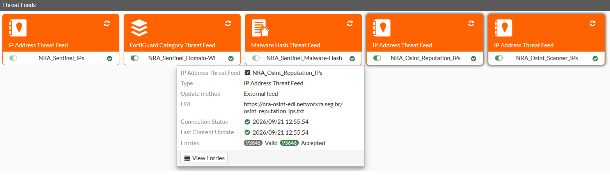

## 🛡️ NRA Sentinel & Osint edl - Inteligência de Ameaças (V33.5)

O **NRA Sentinel** é um projeto desenvolvido com o objetivo de auxiliar profissionais de segurança e redes na proteção de suas infraestruturas contra 0-days, Botnets, Malware e Ransomware. Ele automatiza a coleta e a organização de dados de novas ameaças globais, entregando listas limpas e prontas para uso no **External Resource** do FortiGate. Este motor não busca ser uma "solução milagrosa", mas sim uma ferramenta de apoio que soma forças aos recursos que você já utiliza no dia a dia, ideal para quem busca reforçar ainda mais a segurança.


<p align="left"><sub><i>Workflow detalhado: Da coleta em fontes globais à entrega sanitizada ao seu Firewall.</i></sub></p>

---

O **NRA Osint edl - IP Reputation e Scanners IPs** é um projeto comunitário desenvolvido com o objetivo de democratizar a segurança na borda, auxiliando profissionais, empresas e provedores (MSSPs) que operam appliances sem licenciamento ativo devido às atuais restrições orçamentárias do país. Ele automatiza a extração, a sumarização CIDR, entregando listas oficiais do Spamhaus DROP, Emerging Threats, Firehol, CISA, entre outros players open source. Todos protegidos pela nossa Safelist e pronto para consumo nativo por **External Resource** do seu Firewall. 

Esta arquitetura não busca substituir o modelo comercial do fabricante, mas sim atuar como uma engenharia de solidariedade técnica que preenche a lacuna de quem estaria desprotegido, garantindo que a condição financeira não seja uma barreira para a segurança da sua rede.


<p align="left"><sub><i>Workflow detalhado: Da compilação de fontes OSINT globais à entrega ao seu Firewall.</i></sub></p>

---


<p align="left"><sub><i>Exemplo de operação dos conectores NRA Sentinel e NRA Osint edl no ambiente Fortinet.</i></sub></p>

---

**O Projeto agora está oficialmente publicado na Cloudflare. Domínio networkra.seg.br**

<i>Maior estabilidade, baixa latência e alta disponibilidade para operações de SOC e MSSP</i>

---

### 🧠 Fontes de Dados
O motor busca informações em fontes respeitadas, garantindo que o que chega ao seu Firewall tenha passado por um processo de filtragem:

| Player / Fonte | Projeto | Função |
| :--- | :---: | :--- |
| **AlienVault (LevelBlue)** |  | Fornece inteligência estratégica sobre campanhas de Ransomware e 0-days. |
| **MalwareBazaar (abuse.ch)** |  | Entrega assinaturas de arquivos (Hashes) validadas pela comunidade. |
| **URLHaus (abuse.ch)** |  | Monitora links que estão distribuindo malware no exato momento. |
| **AbuseIPDB** |  | Ajuda a validar a reputação dos IPs, evitando falsos positivos. |
| **urlscan.io** |  | Verifica o histórico de segurança dos domínios e URLs processadas. |
| **Bases OSINT** |  | Inteligência de IPs Maliciosos e Scanners globais, democratizando o bloqueio na borda para caixas desassistidas. |
---

### 🛡️ Prevenção de Falsos Positivos
Para garantir que infraestruturas legítimas não sejam bloqueadas acidentalmente, o NRA Sentinel conta com uma esteira de dupla validação antes de aprovar qualquer bloqueio:

1. **Safelist (Exceção Absoluta):** Todo IP extraído dos feeds é cruzado com o arquivo local `nra-safelist.txt`. Se o IP constar nesta lista, ele é imediatamente descartado, protegendo a sua infraestrutura.
2. **Validação de Reputação (AbuseIPDB):** Caso o IP não esteja na Safelist, ele passa por uma checagem em tempo real. O artefato só é incluído no conector final do FortiGate se atingir um *Abuse Confidence Score* igual ou superior a **20%**. 
*(Nota: Indicadores classificados como ameaças críticas de **0-day** recebem prioridade máxima de bloqueio, mas ainda assim são obrigados a respeitar a Safelist).*

**Origem dos Dados (Safelist):** A nossa lista base de provedores DNS globais foi extraída e curada a partir da documentação oficial do **[AdGuard DNS Providers](https://adguard-dns.io/kb/pt-BR/general/dns-providers/)**. 

---

### ⚙️ Detalhes do Funcionamento

* **Atualização (NRA Sentinel):** Os feeds de *0-days* e IoCs são processados e atualizados automaticamente a cada **8 horas**.
* **Atualização (NRA Osint edl):** O Osint é executado **1 vez ao dia**. Essa cadência diária garante uma lista sempre fresca sem gerar overhead de requisições ou consumo excessivo de API nas fontes primárias (provedores OSINT).
* **Persistência:** O motor mantém o histórico acumulado com regra cronológica estrita (regra FIFO para rotatividade e substituição de artefatos antigos).
* **Limpeza:** Dados sanitizados (remoção automática de protocolos, portas, *query strings* e validação via Safelist), entregando listas limpas para leitura nativa via CLI.
* **Segmentação e Espelhamento:** Entregamos inteligência dimensionada conforme a memória RAM do seu hardware (Tiers no Sentinel) e replicação nativa para caixas sem licença (EDL).

---

### 🛡️ Rotação e Performance (Multi-Tier & EDL Mirror)

Para manter a filosofia **Sniper** (precisão sobre volume), nosso ecossistema entrega a inteligência na medida certa para o seu hardware, garantindo estabilidade no **WAD/IPS Engine** e trabalhando para manter seu FortiOS fora de *Conserve Mode*:

| Projeto & Tier | Modelo de Referência | Capacidade / Trava Máxima |
| :--- | :--- | :--- |
| 🛡️ **Sentinel (Entry-Level)** | 40F, 60F, 80F (2GB-3GB RAM) | 35.000 IoCs por categoria |
| 🛡️ **Sentinel (Mid-Range)** | 100F a 600F (4GB-8GB RAM) | 150.000 IoCs por categoria |
| 🛡️ **Sentinel (High-End)** | Data Centers / Clusters | 300.000 IoCs por categoria |
| 🌐 **Osint edl** | Universal *(Caixas sem licença / SOC)* | 150.000 IoCs *(Circuit Breaker)* |

> [!NOTE]
> **Por que o NRA Osint edl tem uma trava de 150.000 IoCs?**
> A base diária do Osint consolidada (sumarizada via CIDR) costuma girar entre 60.000 e 100.000 blocos únicos. Fixamos uma trava de segurança (*Circuit Breaker*) em exatamente **150.000 linhas** no código Python. Se por qualquer anomalia global de BGP ou na fonte original esse número for ultrapassado, o sistema aborta a sincronização e preserva a lista anterior intacta. Isso impede que appliances menores da comunidade (como 40F ou 60F) entrem em esgotamento de memória (*Conserve Mode/WAD*) ao tentar processar feeds anomalamente gigantescos.

> [!NOTE]
> **Como escolher o seu feed?**
> A escolha do Tier deve ser feita com base na memória RAM do seu appliance. Se o dispositivo possui 2GB de RAM, utilize obrigatoriamente a versão `critical` (Entry). Se você gerencia ambientes com caixas de maior porte (Mid ou High), pode escalar o nível de proteção utilizando os arquivos `mid-critical` ou `high-critical` para uma maior abrangência de ameaças. Exemplo de como validar sua memória:
```
NetworkRA # diagnose hardware sysinfo conserve 
memory conserve mode:                        off
total RAM:                                         1917 MB
memory used:                                        796 MB   41% of total RAM
memory freeable:                                    270 MB   14% of total RAM
memory used + freeable threshold extreme:          1821 MB   95% of total RAM
memory used threshold red:                         1687 MB   88% of total RAM
memory used threshold green:                       1572 MB   82% of total RAM
```

---

### 🌐 NRA Osint edl (Community Edition)

Desenvolvemos o que muitos consideravam improvável: um motor de engenharia tática capaz de democratizar o acesso à inteligência de ameaças de elite, provando que a proteção da borda não deve ser um privilégio, mas um direito de toda infraestrutura.

Estamos entregando uma solução audaciosa que preenche a lacuna entre a 'segurança zero' e a 'proteção total'. É uma engenharia de guerrilha para tempos difíceis.

> [!IMPORTANT]
> **DEMOCRATIZANDO A SEGURANÇA NA BORDA (100% FREE)**
> Sabemos que a realidade econômica atual impõe desafios severos aos orçamentos de TI. Muitas empresas, provedores (MSSPs) e analistas que mantêm laboratórios de estudos acabam operando appliances sem o licenciamento ativo devido aos altos custos de renovação. **A segurança da sua rede não pode ficar desamparada por restrições financeiras.**

Com o objetivo de contribuir diretamente com a nossa comunidade e fortalecer o ecossistema nacional de cibersegurança, desenvolvemos essa lista dinâmica: **NRA Osint edl - IP Reputation** e o **NRA Osint edl - Scanners IPs**. 

Trata-se de uma engenharia de **Coleta e Sumarização**, onde nosso motor automatizado extrai, sanitiza e consolida continuamente as bases open-source de reputação de IPs, domínios e hash´s e disponibiliza toda essa inteligência de forma gratuita através de nossa lista no GitHub.

### 🛡️ O que estamos replicando para o seu Firewall?

Nosso feed oferece:

###  1. Ameaças Ativas & Reputação
* 🚨 **Botnet-C&C:** Servidores de Comando e Controle de Botnets globais.
* 🛑 **Malicious:** Hosts catalogados em ataques ativos e drop de malwares.
* 🎣 **Phishing:** Infraestruturas conhecidas por hospedagem de páginas de Phishing.
* ⛏️ **Blockchain-Crypto.Mining:** Pools de mineração não autorizada (Cryptojacking).
* 🧅 **Tor Nodes (Exit, Relay, Tor):** Nós da rede TOR frequentemente utilizados para anonimizar invasões.
* 🕵️ **Proxy & Anonymous VPN:** Serviços de mascaramento de IP usados para burlar perímetros.

###  2. Motores de Reconhecimento (Anti-Scanning)
Para evitar que sua infraestrutura seja mapeada por atacantes buscando CVEs ou interfaces expostas, replicamos a base completa de Scanners. O feed bloqueia proativamente milhares de prefixos de varredura massiva na internet, englobando:

* 👁️ **Global Scanners:** Shodan, Censys, Rapid7, Shadowserver, BinaryEdge, LeakIX.
* 🔍 **Corporate & Gov Scanners:** Palo Alto Cortex Xpanse, Internet Census Group, UK NCSC, NetScout.
* 🕷️ **Mass Crawlers & Recon:** Stretchoid, CriminalIP, Hadrian, ONYPHE, entre dezenas de outros bots de enumeração.

### ⚙️ Como configurar em Firewalls sem licença?
Consulte o passo a passo logo abaixo.

---
### <mark>&nbsp;🚀 Guia de Configuração Rápida (FortiOS CLI)&nbsp;</mark>
> [!WARNING]
> 🚨 As URLs antigas baseadas em `raw.githubusercontent.com` **se tornaram legadas**. Pedimos gentilmente que todos os usuários atualizem seus conectores externos (External Connectors) no FortiGate para as novas URLs Oficiais hospedadas na Cloudflare.

---

### 🔗 URLs Oficiais (Novos Endereços)

Nossa inteligência é dividida em três camadas para se adequar à capacidade de hardware do seu equipamento.

### 🟢 1. NRA Sentinel - Entry-Level
Feeds focados em ameaças ativas, Botnets, C&C e malwares de alta criticidade.
* **IPs:** `https://nra-sentinel-feeds.networkra.seg.br/nra-ips-critical-1.txt`
* **Domains:** `https://nra-sentinel-feeds.networkra.seg.br/nra-dom-critical-1.txt`
* **Hashes (Malware):** `https://nra-sentinel-feeds.networkra.seg.br/nra-hash-critical-1.txt`

### 🟡 2. NRA Sentinel - Midrange
Base estendida contendo o nível Critical + IoCs adicionais com tempo de vida (TTL) maior.
* **IPs:** `https://nra-sentinel-feeds.networkra.seg.br/nra-ips-mid-critical-1.txt`
* **Domains:** `https://nra-sentinel-feeds.networkra.seg.br/nra-dom-mid-critical-1.txt`
* **Hashes (Malware):** `https://nra-sentinel-feeds.networkra.seg.br/nra-hash-mid-critical-1.txt`

### 🔴 3. NRA Sentinel - High-End
Base completa de Threat Intelligence com amplo histórico de IoCs e varreduras abrangentes.
* **IPs:** `https://nra-sentinel-feeds.networkra.seg.br/nra-ips-high-critical-1.txt`
* **Domains:** `https://nra-sentinel-feeds.networkra.seg.br/nra-dom-high-critical-1.txt`
* **Hashes (Malware):** `https://nra-sentinel-feeds.networkra.seg.br/nra-hash-high-critical-1.txt`

---

### 🛡️ 4. NRA Osint edl (Módulos Específicos)
Listas complementares focadas em reputação e mitigação de scanners da internet.
* **IP Reputation:** `https://nra-osint-edl.networkra.seg.br/osint_reputation_ips.txt`
* **Scanners / Scrapers:** `https://nra-osint-edl.networkra.seg.br/osint_scanner_ips.txt`

---

### ⚙️ Como configurar no FortiGate

1. Acesse o seu FortiGate via interface web (GUI).
2. Navegue até **Security Fabric** -> **External Connectors**.
3. Clique em **Create New** e selecione o tipo de lista (IP Address, Domain Name, ou Malware Hash).
4. Insira um nome descritivo (ex: `NRA-Sentinel-IP-Critical`).
5. Cole a **URL Oficial** correspondente fornecida acima.
6. Defina o **Refresh Rate** (Taxa de atualização) para **60 minutos** (recomendado).
7. Certifique-se de que o Status está ativado e clique em OK.
8. Utilize essas listas em suas **Firewall Policies**, **AntiVírus** e **Web-Filters** aplicando a ação adequada.

> **Nota de Responsabilidade**:
> A inteligência do Sentinel é baseada em fontes de terceiros. Embora o esforço para minimizar erros seja constante, a decisão final de bloqueio e o monitoramento do tráfego são de responsabilidade do administrador da rede. Trabalhe com cautela e monitoramento.

---

### 💎 Como posso apoiar o Projeto?

Todo o ecossistema **NRA Sentinel & Osint edl** é **100% gratuito, open-source e livre de restrições**. Nossa missão é fortalecer a segurança da comunidade sem barreiras financeiras. Siga os passos abaixo para blindar o seu ambiente hoje mesmo:

🔗 **Entre no grupo do Telegram:** [NRA Sentinel & Osint edl Alerts](https://t.me/+jHlbAlp-7Xg0MTJh)

🤖 **Apoie o Projeto:** Se este projeto economiza tempo da sua equipe ou agrega valor à segurança dos clientes da sua empresa/MSSP, considere apoiar a nossa iniciativa tornando-se um membro no nível **Sentinel** ou **MSSP** do [Canal NetworkRA no YouTube](https://www.youtube.com/channel/UCs8isxhuF4phuQXimE52tOg/join)

---

### 🏆 Hall da Fama: Apoiadores Oficiais

Esta seção é dedicada a agradecer publicamente aos arquitetos, analistas e provedores de serviços gerenciados (MSSPs) que reconheceram e apoiaram o projeto através do nível **NetworkRA MSSP**.

Graças a vocês, o Projeto continua evoluindo.

| 🛡️ Nome / Empresa | 🔗 Perfil Profissional | 📅 Apoiador Desde |
| :--- | :--- | :--- |
| *@RodrigoAssinger* | *LinkedIn / Site* | *Agosto/2026* |
| *Vaga disponível* | - | - |
| *Vaga disponível* | - | - |

> 💡 **Como ter o seu nome aqui?**
> Se este projeto economiza tempo da sua equipe ou traz segurança para os seus clientes, considere apoiar a manutenção do código. Torne-se um membro **NetworkRA MSSP** no nosso canal do YouTube e faça parte da elite que mantém essa inteligência rodando!
> 
> 👉 **[Apoie o Projeto Aqui](https://www.youtube.com/@NetworkRA/join)**

---

### 🤝 Créditos e Comunidade

O **NRA Sentinel & Osint edl** cresce graças ao feedback destes Especialistas que visitaram o Projeto e deixaram sua contribuição:

*   **[@faustocaldeira](https://github.com/faustocaldeira/):** Pela sugestão da Safelist (AdGuard), ajudando a prevenir falsos positivos e erros humanos.
*   **@RodrigoAssinger:** Pela sugestão da implementação (Multi-Tier), permitindo o suporte escalável para hardwares Mid-Range e High-End.
*   **@MsAbreu000:** Pelo reporte do erro de autenticação envolvendo a criptografia (PBKDF2).

---

### 👨‍💻 Sobre o Autor

**Robert Alexandrino (NetworkRA)** - *Especialista em Segurança de Redes e Arquiteto MSSP*

---

### ⚖️ Licença e Copyright

Este projeto é desenvolvido e mantido por **Robert Alexandrino (NetworkRA)**.

© 2026 NetworkRA. Todos os direitos reservados.
O uso deste feed é **100% gratuito e aberto para toda a comunidade** de cibersegurança. Sinta-se livre para utilizá-lo na proteção dos seus ambientes e laboratórios.

🔗 **[LinkedIn - Robert Alexandrino](https://www.linkedin.com/in/networkra/)** | 📺 **[YouTube - NetworkRA](https://www.youtube.com/@NetworkRA)** | 🔗 **[Telegram - NRA Sentinel](https://t.me/+jHlbAlp-7Xg0MTJh)**
