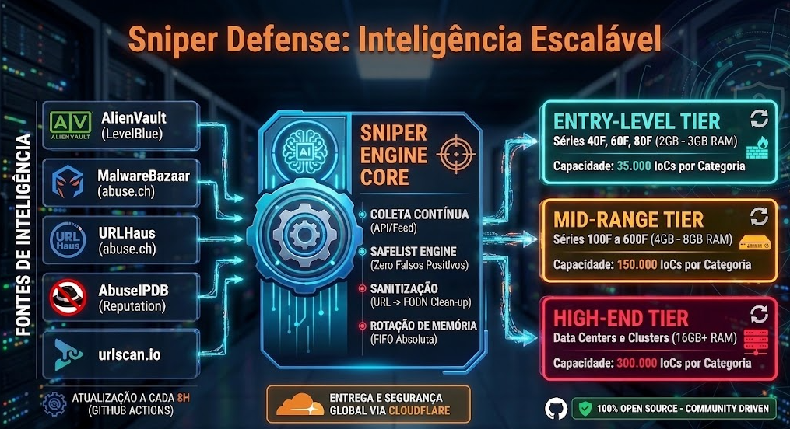
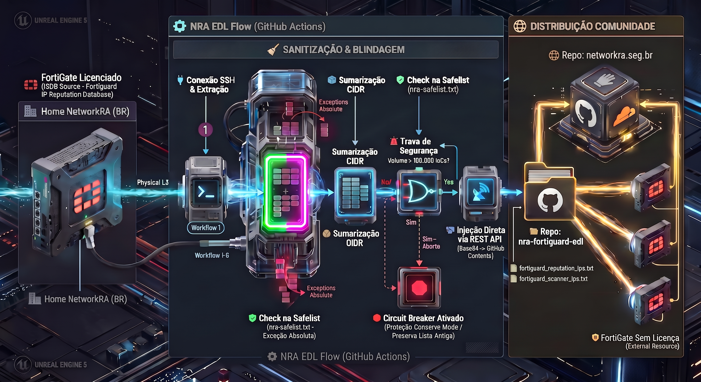
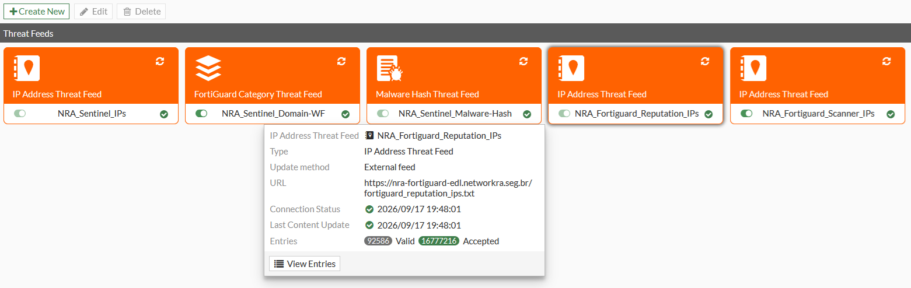

## 🛡️ NRA Sentinel & EDL - Ecossistema de Inteligência de Ameaças (V33.5)

O **NRA Sentinel** é um projeto desenvolvido com o objetivo de auxiliar profissionais de segurança e redes na proteção de suas infraestruturas contra 0-days, Botnets, Malware e Ransomware. Ele automatiza a coleta e a organização de dados de novas ameaças globais, entregando listas limpas e prontas para uso no **External Resource** do FortiGate. Este motor não busca ser uma "solução milagrosa", mas sim uma ferramenta de apoio que soma forças aos recursos que você já utiliza no dia a dia, ideal para quem busca reforçar ainda mais a segurança.


<p align="left"><sub><i>Workflow NRA Sentinel detalhado: Da coleta em fontes globais à entrega sanitizada no perímetro via FortiOS.</i></sub></p>

---

O **NRA EDL - FortiGuard IP Reputation Database Mirror e Fortiguard Scanners IPs Mirror** é um projeto comunitário desenvolvido com o objetivo de democratizar a segurança na borda, auxiliando profissionais, empresas e provedores (MSSPs) que operam appliances FortiGate sem licenciamento ativo devido às atuais restrições orçamentárias do país. Ele automatiza a extração, a sumarização CIDR e o espelhamento contínuo das bases oficiais de reputação de IPs do ISDB (Internet Service Database) de caixas licenciadas, além dos IPs dos ISDBs de Scanners, entregando um feed limpo, protegido pela nossa Safelist e pronto para consumo nativo por **External Resource** do FortiGate. 

Esta arquitetura não busca substituir o modelo comercial do fabricante, mas sim atuar como uma engenharia de solidariedade técnica que preenche a lacuna de quem estaria desprotegido, garantindo que a condição financeira não seja uma barreira para a segurança da sua rede.


<p align="left"><sub><i>Workflow NRA EDL detalhado: Da coleta em um FortiGate licenciado à entrega sanitizada no perímetro via FortiOS.</i></sub></p>

---


<p align="left"><sub><i>Exemplo da integração dos conectores NRA Sentinel e NRA EDL operando em ambiente FortiOS.</i></sub></p>

---

### 🧠 Fontes de Dados

**Para garantir estabilidade, baixa latência e alta disponibilidade para operações de SOC e MSSP, **o NRA Sentinel agora é entregue via CDN (Cloudflare) utilizando domínio corporativo.**

O motor busca informações em fontes respeitadas mundialmente, garantindo que o que chega ao seu Firewall tenha passado por um processo de filtragem:

| Player / Fonte | Projeto | Função |
| :--- | :---: | :--- |
| **AlienVault (LevelBlue)** |  | Fornece inteligência estratégica sobre campanhas de Ransomware e 0-days. |
| **MalwareBazaar (abuse.ch)** |  | Entrega assinaturas de arquivos (Hashes) validadas pela comunidade. |
| **URLHaus (abuse.ch)** |  | Monitora links que estão distribuindo malware no exato momento. |
| **AbuseIPDB** |  | Ajuda a validar a reputação dos IPs, evitando falsos positivos. |
| **urlscan.io** |  | Verifica o histórico de segurança dos domínios e URLs processadas. |
| **FortiGuard (ISDB)** |  | Espelha a reputação oficial de IPs de appliances licenciados (10 categorias críticas), democratizando o bloqueio na borda para caixas sem licença. |
---

### 🛡️ Prevenção de Falsos Positivos
Para garantir que infraestruturas legítimas não sejam bloqueadas acidentalmente, o NRA Sentinel conta com uma esteira de dupla validação antes de aprovar qualquer bloqueio:

1. **Safelist (Exceção Absoluta):** Todo IP extraído dos feeds é cruzado com o arquivo local `nra-safelist.txt`. Se o IP constar nesta lista, ele é imediatamente descartado, protegendo a sua infraestrutura.
2. **Validação de Reputação (AbuseIPDB):** Caso o IP não esteja na Safelist, ele passa por uma checagem em tempo real. O artefato só é incluído no conector final do FortiGate se atingir um *Abuse Confidence Score* igual ou superior a **20%**. 
*(Nota: Indicadores classificados como ameaças críticas de **0-day** recebem prioridade máxima de bloqueio, mas ainda assim são obrigados a respeitar a Safelist).*

**Origem dos Dados (Safelist):** A nossa lista base de provedores DNS globais foi extraída e curada a partir da documentação oficial do **[AdGuard DNS Providers](https://adguard-dns.io/kb/pt-BR/general/dns-providers/)**. 

---

### ⚙️ Detalhes do Funcionamento

* **Atualização (NRA Sentinel):** Os feeds de *0-days* e IoCs são processados e atualizados automaticamente a cada **8 horas**.
* **Atualização (NRA EDL):** O espelhamento da base oficial do FortiGuard é executado **1 vez ao dia**. Essa cadência diária garante uma lista sempre fresca sem gerar overhead de requisições ou consumo excessivo de API no firewall de origem.
* **Persistência:** O motor mantém o histórico acumulado com regra cronológica estrita (regra FIFO para rotatividade e substituição de artefatos antigos).
* **Limpeza:** Dados sanitizados (remoção automática de protocolos, portas, *query strings* e validação via Safelist), entregando listas limpas para leitura nativa via CLI.
* **Segmentação e Espelhamento:** Entregamos inteligência dimensionada conforme a memória RAM do seu hardware (Tiers no Sentinel) e replicação nativa para caixas sem licença (EDL).

---

### 🛡️ Rotação e Performance (Multi-Tier & EDL Mirror)

Para manter a filosofia **Sniper** (precisão sobre volume), nosso ecossistema entrega a inteligência na medida certa para o seu hardware, garantindo estabilidade no **WAD/IPS Engine** e trabalhando para manter seu FortiOS fora de *Conserve Mode*:

| Projeto & Tier | Modelo de Referência | Capacidade / Trava Máxima |
| :--- | :--- | :--- |
| 🛡️ **Sentinel (Entry-Level)** | 40F, 60F, 80F (2GB-3GB RAM) | 35.000 IoCs por categoria |
| 🛡️ **Sentinel (Mid-Range)** | 100F a 600F (4GB-8GB RAM) | 150.000 IoCs por categoria |
| 🛡️ **Sentinel (High-End)** | Data Centers / Clusters | 300.000 IoCs por categoria |
| 🌐 **NRA EDL (FortiGuard Mirror)** | Universal *(Caixas sem licença / SOC)* | 150.000 IoCs *(Circuit Breaker)* |

> [!NOTE]
> **Por que o NRA EDL tem uma trava de 150.000 IoCs?**
> A base diária do FortiGuard consolidada (sumarizada via CIDR) costuma girar entre 60.000 e 100.000 blocos únicos. Fixamos uma trava de segurança (*Circuit Breaker*) em exatamente **150.000 linhas** no código Python. Se por qualquer anomalia global de BGP ou na fonte original esse número for ultrapassado, o sistema aborta a sincronização e preserva a lista anterior intacta. Isso impede que appliances menores da comunidade (como 40F ou 60F) entrem em esgotamento de memória (*Conserve Mode/WAD*) ao tentar processar feeds anomalamente gigantescos.

> [!NOTE]
> **Como escolher o seu feed?**
> A escolha do Tier deve ser feita com base na memória RAM do seu appliance. Se o dispositivo possui 2GB de RAM, utilize obrigatoriamente a versão `critical` (Entry). Se você gerencia ambientes com caixas de maior porte (Mid ou High), pode escalar o nível de proteção utilizando os arquivos `mid-critical` ou `high-critical` para uma maior abrangência de ameaças. Exemplo de como validar sua memória:
```
NetworkRA # diagnose hardware sysinfo conserve 
memory conserve mode:                        off
total RAM:                                         1917 MB
memory used:                                        796 MB   41% of total RAM
memory freeable:                                    270 MB   14% of total RAM
memory used + freeable threshold extreme:          1821 MB   95% of total RAM
memory used threshold red:                         1687 MB   88% of total RAM
memory used threshold green:                       1572 MB   82% of total RAM
```

---

### 🌐 NRA EDL - FortiGuard (Community Edition)

Desenvolvemos o que muitos consideravam improvável: um motor de engenharia reversa tática capaz de democratizar o acesso à inteligência de ameaças de elite, provando que a proteção da borda não deve ser um privilégio, mas um direito de toda infraestrutura.

Estamos entregando uma solução audaciosa que preenche a lacuna entre a 'segurança zero' e a 'proteção total'. É uma engenharia de guerrilha para tempos difíceis.

> [!IMPORTANT]
> **DEMOCRATIZANDO A SEGURANÇA NA BORDA (100% FREE)**
> Sabemos que a realidade econômica atual impõe desafios severos aos orçamentos de TI. Muitas empresas, provedores (MSSPs) e analistas que mantêm laboratórios de estudos acabam operando appliances FortiGate sem o licenciamento ativo do FortiGuard devido aos altos custos de renovação. **A segurança da sua rede não pode ficar desamparada por restrições financeiras.**

Com o objetivo de contribuir diretamente com a nossa comunidade e fortalecer o ecossistema nacional de cibersegurança, desenvolvemos duas novas lsitas dinâmicas: **NRA EDL - FortiGuard IP Reputation Database Mirror** e o **NRA EDL - FortiGuard Scanners IPs Mirror**. 

Trata-se de uma engenharia de **Replicação e Espelhamento (Mirror)**: nosso motor automatizado extrai, sanitiza e consolida continuamente a base oficial de reputação de IPs do *Internet Service Database (ISDB)* de appliances licenciados e disponibiliza toda essa inteligência de forma gratuita através de nossa lista no GitHub.

### 🛡️ O que estamos replicando para a sua caixa?

O feed atualiza automaticamente **Todas as categorias críticas de reputação** do FortiGuard:

###  1. Ameaças Ativas & Reputação
* 🚨 **Botnet-C&C.Server:** Servidores de Comando e Controle de Botnets globais.
* 🛑 **Malicious-Malicious.Server:** Hosts catalogados em ataques ativos e drop de malwares.
* 🎣 **Phishing-Phishing.Server:** Infraestruturas conhecidas por hospedagem de páginas de Phishing.
* ⛏️ **Blockchain-Crypto.Mining.Pool:** Pools de mineração não autorizada (Cryptojacking).
* 🧅 **Tor Nodes (Exit, Relay, Tor):** Nós da rede TOR frequentemente utilizados para anonimizar invasões.
* 🕵️ **Proxy & Anonymous VPN:** Serviços de mascaramento de IP usados para burlar perímetros.

###  2. Motores de Reconhecimento (Anti-Scanning)
Para evitar que sua infraestrutura seja mapeada por atacantes buscando CVEs ou interfaces expostas, replicamos a base completa de Scanners. O feed bloqueia proativamente milhares de prefixos de varredura massiva na internet, englobando:

* 👁️ **Global Scanners:** Shodan, Censys, Rapid7, Shadowserver, BinaryEdge, LeakIX.
* 🔍 **Corporate & Gov Scanners:** Palo Alto Cortex Xpanse, Internet Census Group, UK NCSC, NetScout.
* 🕷️ **Mass Crawlers & Recon:** Stretchoid, CriminalIP, Hadrian, ONYPHE, entre dezenas de outros bots de enumeração.

### ⚙️ Como consumir em appliances sem licença?
Consulte o passo a passo logo abaixo, no Guia de Configuração Rápida (FortiOS CLI).

---
### <mark>&nbsp;🚀 Guia de Configuração Rápida (FortiOS CLI)&nbsp;</mark>
> [!WARNING]
> 🚨 **Deprecation Notice:** As URLs antigas baseadas em `raw.githubusercontent.com` **se tornaram legadas**. Pedimos gentilmente que todos os usuários atualizem as configurações de seus conectores externos (External Connectors) no FortiGate para as novas URLs oficiais listadas abaixo.

---

### 🔗 URLs Oficiais (Novos Endereços)

Nossa inteligência é dividida em três camadas para se adequar à capacidade de hardware do seu equipamento (Entry-level, Midrange e High-end). 

### 🟢 1. NRA Sentinel - Entry-Level
Feeds focados em ameaças ativas, Botnets, C&C e malwares de alta criticidade.
* **IPs:** `https://nra-sentinel-feeds.networkra.seg.br/nra-ips-critical-1.txt`
* **Domains:** `https://nra-sentinel-feeds.networkra.seg.br/nra-dom-critical-1.txt`
* **Hashes (Malware):** `https://nra-sentinel-feeds.networkra.seg.br/nra-hash-critical-1.txt`

### 🟡 2. NRA Sentinel - Midrange
Base estendida contendo o nível Critical + IoCs adicionais com tempo de vida (TTL) maior.
* **IPs:** `https://nra-sentinel-feeds.networkra.seg.br/nra-ips-mid-critical-1.txt`
* **Domains:** `https://nra-sentinel-feeds.networkra.seg.br/nra-dom-mid-critical-1.txt`
* **Hashes (Malware):** `https://nra-sentinel-feeds.networkra.seg.br/nra-hash-mid-critical-1.txt`

### 🔴 3. NRA Sentinel - High-End
Base completa de Threat Intelligence com amplo histórico de IoCs e varreduras abrangentes.
* **IPs:** `https://nra-sentinel-feeds.networkra.seg.br/nra-ips-high-critical-1.txt`
* **Domains:** `https://nra-sentinel-feeds.networkra.seg.br/nra-dom-high-critical-1.txt`
* **Hashes (Malware):** `https://nra-sentinel-feeds.networkra.seg.br/nra-hash-high-critical-1.txt`

---

### 🛡️ 4. FortiGuard EDLs (Módulos Específicos)
Listas complementares focadas em reputação e mitigação de scanners da internet.
* **IP Reputation:** `https://nra-fortiguard-edl.networkra.seg.br/fortiguard_reputation_ips.txt`
* **Scanners / Scrapers:** `https://nra-fortiguard-edl.networkra.seg.br/fortiguard_scanner_ips.txt`

---

## ⚙️ Como configurar no FortiGate

1. Acesse o seu FortiGate via interface web (GUI).
2. Navegue até **Security Fabric** -> **External Connectors**.
3. Clique em **Create New** e selecione o tipo de lista (IP Address, Domain Name, ou Malware Hash).
4. Insira um nome descritivo (ex: `NRA-Sentinel-IP-Critical`).
5. Cole a **URL Oficial** correspondente fornecida acima.
6. Defina o **Refresh Rate** (Taxa de atualização) para **60 minutos** (recomendado).
7. Certifique-se de que o Status está ativado e clique em OK.
8. Utilize essas listas em suas **Firewall Policies**, **AntiVírus** e **Web-Filters** aplicando a ação adequada.

---

### 💎 Como Acessar e Acompanhar

Todo o ecossistema **NRA Sentinel & EDL** é **100% gratuito, open-source e livre de restrições**. Nossa missão é fortalecer a segurança da comunidade sem barreiras financeiras. Siga os passos abaixo para blindar o seu ambiente hoje mesmo:

1. **Implementação Direta (Zero Custo):** Vá até o final desta página, abra o **Guia de Configuração Rápida (FortiOS CLI)**, copie os scripts correspondentes ao seu ambiente (Sentinel Tiers + EDL Mirror) e aplique diretamente no terminal do seu firewall.
2. **Acompanhe a Telemetria ao Vivo (O Pulse do Projeto):** Mantemos um canal aberto e gratuito no Telegram onde nossa esteira de automação reporta, em tempo real, a entrada de novos *0-days*, hashes de malware e os relatórios diários de sincronização das bases ISDB do FortiGuard.
* 🔗 **Entre no grupo e acompanhe as execuções:** [Telegram - NRA Sentinel & EDL Alerts](https://t.me/+jHlbAlp-7Xg0MTJh)
3. **Apoie a Evolução do Projeto (Opcional):** A pesquisa, as horas de engenharia e a infraestrutura de laboratório para manter esses motores rodando geram custos operacionais diários. Se este projeto economiza tempo da sua equipe ou agrega valor à segurança dos clientes da sua empresa/MSSP, considere apoiar a nossa iniciativa tornando-se um membro do [Canal NetworkRA no YouTube](https://www.youtube.com/channel/UCs8isxhuF4phuQXimE52tOg/join). Além de financiar a continuidade destas ferramentas gratuitas para toda a comunidade, você desbloqueia benefícios exclusivos no canal:
* 🧪 **Laboratórios Práticos (Hands-on):** Acesso a imagens, arquivos VMware e topologias `.unl` prontas para importar no EVE-NG, simulando as arquiteturas SD-WAN e VPN mais exigidas pelo mercado de MSSPs.
* 🐍 **Automação & Gestão:** Scripts exclusivos em Python para automação de tarefas de rede, rotinas de backup e *Study Guides* completos para exames de certificação.
* 📊 **Inteligência para FortiAnalyzer:** Templates de relatórios corporativos, *Handlers* e *Correlation Handlers* avançados prontos para implementação imediata em SOC.
* 🤖 **Agentes de IA (GEMS Pro):** Acesso direto aos nossos assistentes de IA personalizados (baseados no Gemini Pro), altamente treinados com documentações de elite e especializados em arquitetura e *troubleshooting* do ecossistema Fortinet.

---

### 🚀 Changelog: NRA Sentinel V33.5

#### 📅 17/09/2026: Infraestrutura Enterprise (Global CDN) e Domínios Corporativos *(Latest)*
* <small>🌍 **Migração para CDN Global (Cloudflare):** *A entrega dos feeds deixou de utilizar o `raw.githubusercontent.com` e agora é servida nativamente pela infraestrutura de edge da Cloudflare (Pages), entregando alta disponibilidade, resiliência e latência zero.*</small>
* <small>🔗 **Domínios Oficiais (.seg.br):** *Ativação dos novos endereços corporativos (`nra-sentinel-feeds.networkra.seg.br` e `nra-fortiguard-edl.networkra.seg.br`), elevando o padrão de confiabilidade para adoção em operações de SOCs e MSSPs.*</small>
* <small>⚡ **Edge Caching em Tempo Real:** *Implementação de Page Rules com TTL otimizado (2 minuto) na borda da CDN, forçando o firewall a baixar imediatamente os IoCs mais recentes gerados pelo motor, eliminando gargalos de cache.*</small>
* <small>🛡️ **Bypass Inteligente de WAF & Anti-Bot:** *Criação de exceções de segurança para o tráfego em arquivos `.txt`, garantindo que os conectores do FortiGate não recebam desafios CAPTCHA e importem as listas sem interrupções.*</small>

---

#### 📅 26/08/2026: Triagem Híbrida e Proteção de Negócios Locais *(Latest)*
* <small>🧠 **URLScan Híbrido (0-Days & NRDs):** *Domínios recém-registrados ou sem histórico reportados pelo AlienVault agora recebem aprovação direta (Trust AlienVault), garantindo bloqueio imediato de campanhas frescas.*</small>
* <small>🛡️ **Mitigação de Falsos Positivos:** *O motor descarta bloqueios de domínios raiz legítimos (ex: sites de empresas invadidos hospedando payloads isolados) que possuem histórico "limpo" no URLScan, protegendo a disponibilidade de negócios na topologia SD-WAN.*</small>
* <small>📊 **Debug Avançado (CI/CD):** *O `stdout` do GitHub Actions agora fornece diagnóstico completo e transparente das decisões da engine (ex: `[ADICIONADO: Domínio 100% Novo]` vs `[DESCARTADO: Site Legítimo]`).*</small>
* <small>🐛 **Bug Fix de Indentação:** *Resolução do erro estrutural `TabError` no script Python, assegurando execuções perfeitas nos runners automatizados do GitHub Actions.*</small>

---

#### 📅 12/08/2026: General Availability (GA) & Scanners IPs Mirror
* <small>🎯 **Espelhamento de Scanners Globais:** *Consolidação contínua de IPs de varredura (Shodan, Censys, Rapid7, etc.) direto da base ISDB da FortiGuard para inibir reconnaissance em ativos VIP.*</small>
* <small>⚙️ **Sobrevida para Ambientes Legacy:** *Proteção otimizada para appliances (FortiOS 6.2 a 7.2) sem licença ativa e sem suporte nativo a ISDB no Local In Policies.*</small>
* <small>🔗 **Interceptação IP & Otimização FQDN:** *O motor agora extrai IPs escondidos em URLs maliciosas, aplicando sanitização rigorosa que remove caminhos/portas, garantindo compatibilidade com o modo Certificate Inspection e prevenindo travamentos no daemon `wad`.*</small>

---

#### 📅 24/07/2026: Expansão do Ecossistema (NRA EDL IP Reputation)
* <small>🌐 **Democratização da Borda:** *Automação que espelha os bancos ISDB oficiais para fornecer proteção gratuita na Camada 3/4 contra C&C, Phishing, Mineração, nós TOR e VPNs anônimas.*</small>
* <small>⚡ **Control Plane Unificado:** *Compartilhamento da `nra-safelist.txt` centralizada (Single Source of Truth) e integração de um Circuit Breaker (trava limitadora de 150.000 prefixos) para blindar os appliances menores.*</small>

---

#### 📅 28/06/2026: Arquitetura Multi-Tier e Sanitização Avançada
* <small>🏗️ **Escalabilidade de Hardware:** *Compilação segregada em três pipelines (Entry, Mid-Range, High-End - até 300.000 IoCs), equilibrando proteção e consumo de RAM.*</small>
* <small>🚀 **Automação Otimizada:** *Fluxos do GitHub Actions escalonados com offset de tempo para evitar Rate Limit nas APIs globais, integrados a relatórios de telemetria operacionais via Telegram.*</small>
* <small>🧽 **URL Clean-up:** *Remoção automática de Query Strings de fontes externas, garantindo que o External Connector do FortiOS não aborte o processo de sincronização por falhas de sintaxe.*</small>

---

#### 📅 24/05/2026: Auditoria de Memória FIFO e Engine Safelist
* <small>🛡️ **Motor de Exceção Híbrida:** *Lançamento da Safelist para proteger provedores de DNS e infraestruturas legítimas de bloqueios acidentais em redes de produção.*</small>
* <small>⏱️ **Rotação Cronológica (Churn Visibility):** *Reescrita da base de armazenamento (migração para `dicts`) forçando o modelo First-In, First-Out. O limite de proteção de 35.000 IoCs passa a ser auditado e registrado publicamente nos logs do console durante as substituições.*</small>

---

### 🏆 Hall da Fama: Apoiadores Oficiais

Hoje, o motor **NRA Sentinel & EDL** é **100% gratuito e de código aberto**. No entanto, a pesquisa, o desenvolvimento contínuo (horas de engenharia) e os custos exigem recursos. Esta seção é dedicada a agradecer publicamente aos arquitetos, analistas e provedores de serviços gerenciados (MSSPs) que reconhecem o valor corporativo desta ferramenta e optaram por patrocinar diretamente o projeto através do nível **NetworkRA MSSP**.

Graças a vocês, o Sentinel continua evoluindo.

| 🛡️ Nome / Empresa | 🔗 Perfil Profissional | 📅 Apoiador Desde |
| :--- | :--- | :--- |
| *Seu Nome ou Empresa Aqui* | *LinkedIn / Site* | *Junho/2026* |
| *Vaga disponível* | - | - |
| *Vaga disponível* | - | - |

> 💡 **Como ter o seu nome aqui?**
> Se este projeto economiza tempo da sua equipe ou traz segurança para os seus clientes, considere apoiar a manutenção do código. Torne-se um membro **NetworkRA MSSP** no nosso canal do YouTube e faça parte da elite que mantém essa inteligência rodando!
> 
> 👉 **[Apoie o Projeto Aqui](https://www.youtube.com/@NetworkRA/join)**

---

### 🤝 Créditos e Comunidade

O **NRA Sentinel & EDL** crescem graças ao feedback e às contribuições de profissionais que testam o motor em ambientes reais de produção:

*   **[@faustocaldeira](https://github.com/faustocaldeira/):** Pela curadoria essencial da base de provedores DNS utilizada na nossa Safelist (AdGuard), ajudando a prevenir falsos positivos e erros humanos.
*   **@RodrigoAssinger:** Pela visão de arquiteto que guiou a implementação da nossa esteira segmentada (Multi-Tier), permitindo o suporte escalável para hardwares Mid-Range e High-End.
*   **@MsAbreu000:** Pelo reporte do erro de autenticação nos conectores externos, que nos levou a mapear a mudança crítica do padrão de criptografia de senhas (PBKDF2) nas novas *releases* do FortiOS, resultando na documentação do script *Legacy* vs *Current*.

---

### 🚀 O Foco do Canal

O canal **NetworkRA** é especializado em **Arquitetura MSSP e Segurança de Redes**, focado em desmistificar cenários reais de infraestrutura através de laboratórios práticos (**Hands-on**). Nosso objetivo é transformar teoria complexa em implementações funcionais e resilientes.

* **SD-WAN Expert:** Especialização em estruturas de *Self-Healing* utilizando BGP e *SLA-based steering* (Lowest Cost, Preferência de Network), além de técnicas de **Hardening** para proteger o plano de controle.
* **VPN & ADVPN Profissional:** Domínio completo de topologias *Hub-and-Spoke*, ADVPN (Single/Multiple Hub), integrações com OSPF (HUBs) Regionais e Hardening proposto com IKEv2 e local-in-policy.
* **Remote Access & Autenticação:** Implementações robustas de VPN Client com **IKEv2 + EAP**, integração com **RADIUS** (Multi-group membership) e autenticação by DC.
* **Automação & Gestão:** Desenvolvimento de ferramentas de automação (Python Scripts) como o *SD-WAN Builder* e gestão centralizada via FortiManager/FortiAnalyzer.
* **Metodologia Hands-on:** Todo o conteúdo é validado em cenários reais utilizando o **EVE-NG**, com arquivos de laboratório exclusivos para membros no Google Drive.
* **Acessibilidade Global:** Vídeos produzidos em Português com legendas profissionais revisadas em **Inglês** e **Espanhol**.

Embora o idioma principal do canal seja o **Português**, acreditamos na democratização do conhecimento técnico:

* **Legendas Profissionais:** Todos os vídeos possuem legendas revisadas manualmente em **Inglês** e **Espanhol**.
* **Comunidade Global:** Profissionais à nível global já utilizam as nossas arquiteturas como referência.

---

### 👨‍💻 Sobre o Autor

**Robert Alexandrino (NetworkRA)** - *Especialista em Arquiteturas MSSP (SD-WAN) & Network Security Engineer*

Acredito que o compartilhamento técnico deve caminhar junto com a valorização do tempo e do esforço. O tempo é o nosso recurso mais escasso; valorizá-lo é respeitar a sua própria jornada.

#### 🎓 Certificações Fortinet

| Certificação | Tecnologia | Status |
| :--- | :--- | :--- |
| **NSE 7** | Enterprise Firewall 7.6 Administrator | Pass (2026) |
| **NSE 7** | Enterprise Firewall 7.4 Administrator | Pass (2025) |
| **NSE 7** | Network Security 7.4 Support Engineer | Pass (2025) |
| **NSE 7** | SD-WAN 7.2 | Pass (2024) |
| **NSE 7** | Enterprise Firewall 7.0 | Pass (2023) |
| **NSE 5** | FortiAnalyzer 6.4 | Pass (2022) |
| **NSE 5** | FortiManager 6.4 | Pass (2022) |
| **NSE 4** | FortiOS 6.4 | Pass (2021) |

---

* [](https://www.linkedin.com/in/networkra/)
* [](https://www.youtube.com/@NetworkRA)
---

> **Nota de Responsabilidade**:
> A inteligência do Sentinel é baseada em fontes de terceiros. Embora o esforço para minimizar erros seja constante, a decisão final de bloqueio e o monitoramento do tráfego são de responsabilidade do administrador da rede. Vamos sempre trabalhar com cautela e monitoramento.

---

### ⚖️ Licença e Copyright

Este projeto é desenvolvido e mantido por **Robert Alexandrino (NetworkRA)**.

© 2026 NetworkRA. Todos os direitos reservados.
O uso deste feed é **100% gratuito e aberto para toda a comunidade** de cibersegurança. Sinta-se livre para utilizá-lo na proteção dos seus ambientes e laboratórios.

🔗 **[LinkedIn - Robert Alexandrino](https://www.linkedin.com/in/networkra/)** | 📺 **[YouTube - NetworkRA](https://www.youtube.com/@NetworkRA)** | 🔗 **[Telegram - NRA Sentinel](https://t.me/+jHlbAlp-7Xg0MTJh)**
